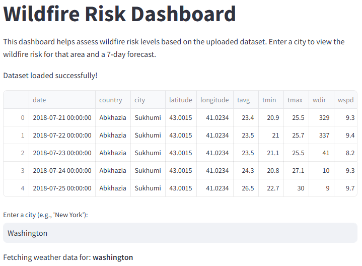
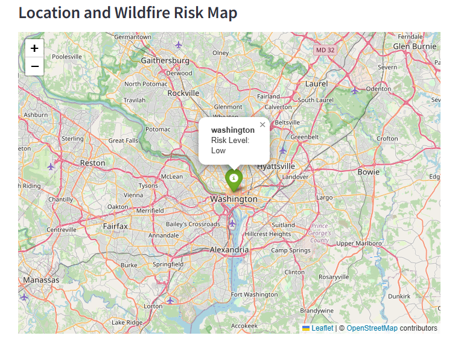
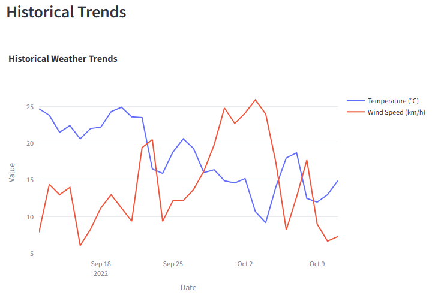
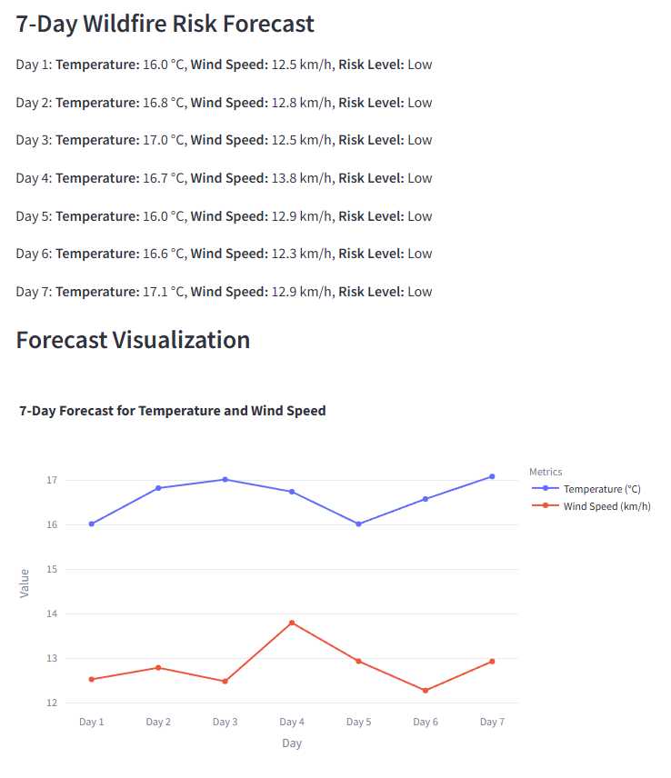

# **Wildfire Risk Monitoring Dashboard**

### **1. Project Goals**
The primary goals of this project are:
- **Real-Time Data Integration**: Use historical and real-time weather data to assess wildfire risk.
- **Machine Learning Predictions**: Develop a model to forecast wildfire risk levels for the next 7 days based on historical weather data.
- **Interactive Dashboard**: Provide a user-friendly web-based dashboard to visualize wildfire risk levels, weather trends, and forecasted data.
- **Geospatial Visualization**: Incorporate a map to display wildfire risk levels for specified locations interactively.

---

### **2. Significance and Novelty of the Project**

#### **Background Information**
Wildfires are devastating natural disasters that can cause extensive damage to ecosystems, property, and human lives. Monitoring wildfire risks based on weather conditions like temperature, wind speed, and humidity can help authorities take preventative measures and mitigate risks.

#### **Significance**
- The dashboard enables users to monitor wildfire risks and analyze weather trends interactively.
- Machine learning-based 7-day predictions empower users to anticipate future wildfire risk levels.
- The map visualization enhances geospatial understanding of risk levels.

#### **Novelty**
- Combines historical weather data with machine learning to predict wildfire risks dynamically.
- Integrates multiple features, including historical trends, real-time forecasts, and geospatial visualization, into a single interactive application.
- Provides users with a platform to explore wildfire risks without relying on external API calls, using an offline dataset.

---

### **3. Installation and Usage Instructions**

#### **Installation**
1. **Clone the Repository**:
   ```bash
   git clone https://github.com/username/WildfireRiskMonitoring
   cd WildfireRiskMonitoring
   ```
2. **Install Dependencies**:
   Ensure you have Python 3.8+ installed, then run:
   ```bash
   pip install -r requirements.txt
   ```
3. **Run the Application**:
   Start the Streamlit server:
   ```bash
   streamlit run main.py
   ```

#### **Usage**
1. Open the provided URL in your browser (typically `http://localhost:8501`).
2. Enter a city name to load historical data and forecast wildfire risks.
3. View:
   - **Current Risk Level**: Displays wildfire risk based on current weather data.
   - **Historical Trends**: View temperature and wind speed trends over the past 30 days.
   - **Geospatial Visualization**: See wildfire risk for the selected location on an interactive map.
   - **7-Day Forecast**: View predicted wildfire risks for the next 7 days with corresponding weather conditions.
4. Interact with forecast visualizations and download the data as required.

---

### **4. Code Structure**

#### **Flow-Chart of Code Structure**


#### **File Descriptions**
1. **`main.py`**: Core application file with data loading, preprocessing, machine learning, and visualization functionalities.
2. **`data/`**: Contains the `daily_weather_data.csv` file with historical weather data.
3. **`requirements.txt`**: Lists the dependencies required to run the application.

---

### **5. List of Functionalities and Verification Results**

#### **Functionalities**
1. **Data Loading**:
   - Load and preprocess historical weather data from `daily_weather_data.csv`.
   - Extract features like temperature, wind speed, and day of the year for predictive modeling.
2. **Visualization**:
   - **Geospatial Map**: Displays wildfire risk levels for user-specified locations.
   - **Historical Weather Trends**: Line plots showing daily temperature and wind speed trends.
   - **7-Day Forecast Visualization**: Line plots for forecasted temperature and wind speed.
3. **Predictive Modeling**:
   - Uses machine learning (Random Forest) to predict wildfire risks for the next 7 days.
   - Incorporates lagged weather data as features to improve prediction accuracy.
4. **Interactive Dashboard**:
   - User-friendly interface to analyze wildfire risks, explore trends, and interact with forecasts.

#### **Verification Results**
- **Weather Data**: Successfully processed and visualized historical data for various cities.
- **Predictive Model**: Demonstrated accurate 7-day predictions using Random Forest with lagged weather features.
- **Visualization**: Produced clear and interactive charts for historical trends and forecasted data.
- **Geospatial Map**: Verified map markers and color-coded risk levels for multiple test locations.

---

### **6. Showcasing the Achievement of Project Goals**

#### **Execution Results**
- **Sample Input**:
    - 

- **Sample Output**:
    - **Geospatial Map**:
        - 
    - **Historical Trends**:
        - 
    - **7-Day Forecast**:
        - 

#### **Discussion**
The project successfully achieves its goal of providing an interactive platform to monitor wildfire risks and predict future conditions. The machine learning model uses historical data effectively to generate reliable forecasts, while visualizations help users interpret the results intuitively.

---

### **7. Discussion and Conclusions**

#### **Project Issues**
1. **Data Quality**: Missing or inconsistent data for some cities may affect prediction accuracy. Future work should focus on data cleaning and imputation techniques.
2. **Model Simplicity**: The Random Forest model does not account for time-series dependencies. Incorporating advanced time-series models like LSTMs could enhance forecast reliability.
3. **Environmental Factors**: The project currently relies on weather data only. Adding variables like vegetation coverage or soil dryness could improve risk assessments.

#### **Limitations**
- Predictions are based solely on historical weather data and do not account for external factors like human activity or vegetation type.
- The model assumes consistent trends across years, which may not hold in changing climatic conditions.

#### **Course Learning Applied**
- **Algorithms**: Implemented Random Forest for prediction with lagged features.
- **Data Preprocessing**: Extracted lagged features and aggregated weather data by location.
- **Visualization**: Created interactive plots and maps using Streamlit and Plotly.
- **Software Development**: Developed a modular application integrating multiple components seamlessly.

#### **Conclusion**
This project successfully integrates data analysis, machine learning, and geospatial visualization into a single application to monitor and predict wildfire risks. The combination of historical trends, real-time forecasts, and interactive features makes this tool valuable for researchers, policymakers, and disaster management teams. Future enhancements could include additional environmental variables and advanced predictive modeling techniques.